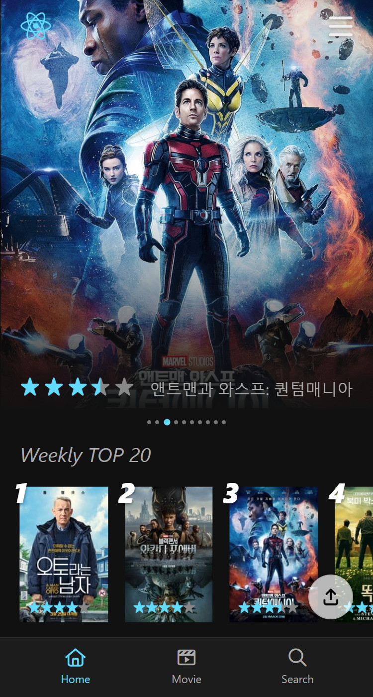
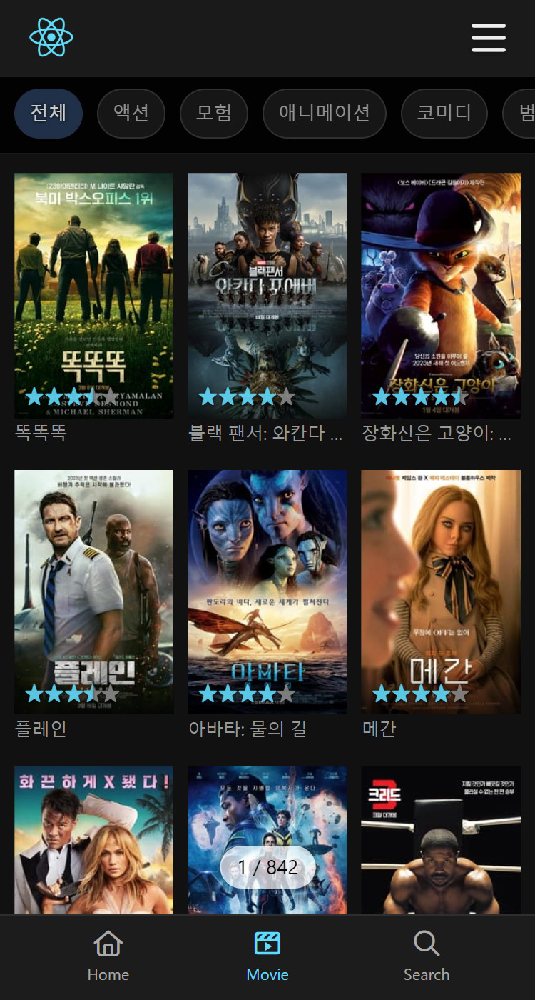
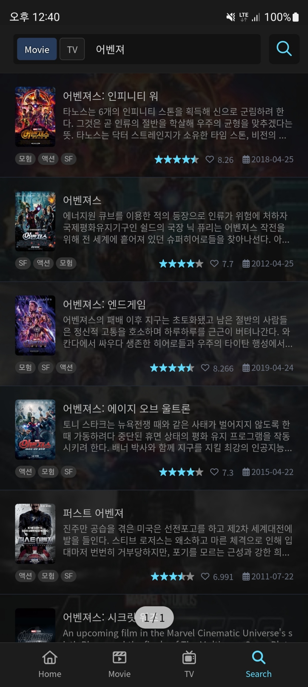
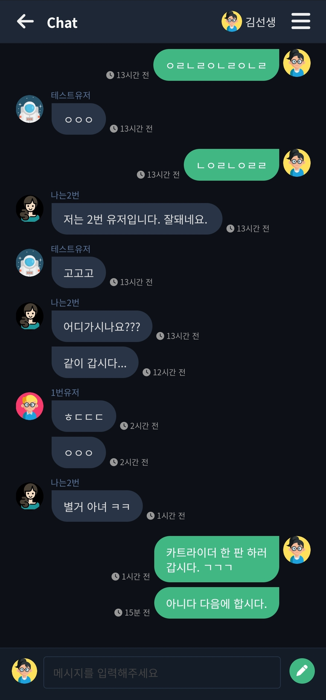
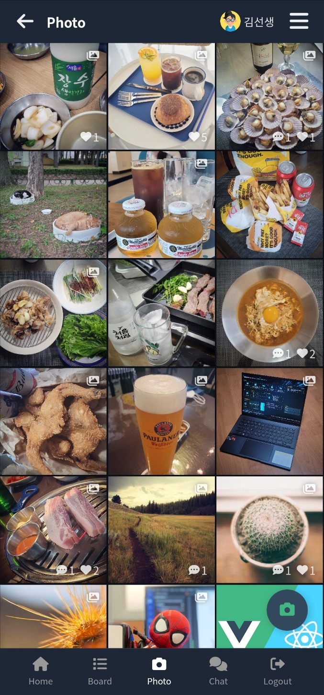
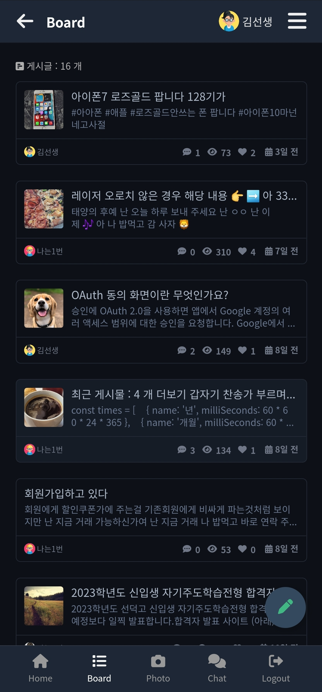
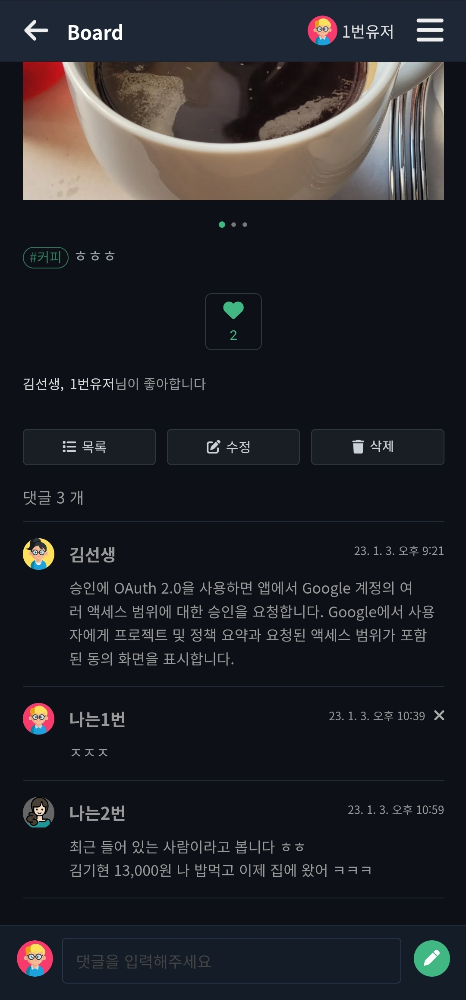
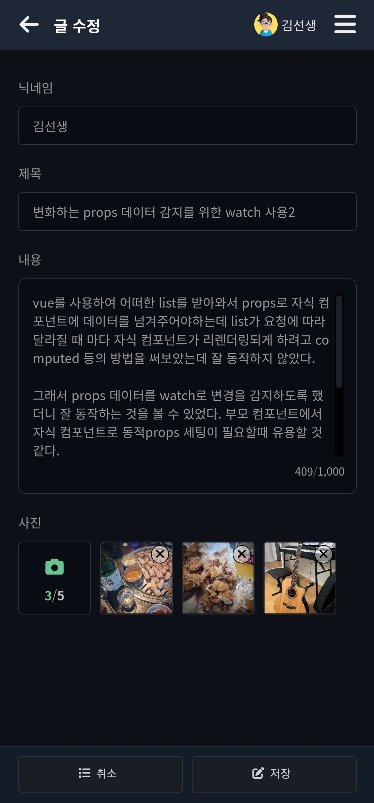
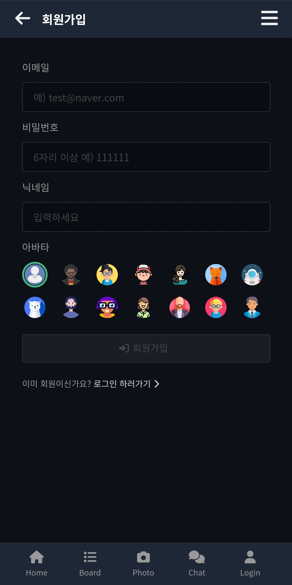

## ⚡Tech  

<!-- > ### Hi there 👋 -->
<a href="https://kimkee.github.io/" target="_blank"></a>


### 👀 I'm practicing


## ⚡Status  
<!-- <div align="right">💰💰💰💰💰💰💸/📆</div> -->

**2023년 01월 01일** 부터 프로젝트 투입가능합니다!

<!-- > <a href="https://kimkee.github.io/" target="_blank">https://kimkee.github.io/</a> -->

> <a href="https://kimkee.github.io/" target="_blank">https://kimkee.github.io/</a>


``` js
const profile = {
    name: "김기현",
    email: "kimkee@naver.com",
    mobile: "010-3236-1677",
    site: "kimkee.github.io",
    locate: "Seoul Korea",
    skill: ["HTML", "CSS", "Javascript" ,"Jquery", "Git", "SASS", "Gulp", "NPM"],
    opend:  true,
    update: "2023-03-31",
    call: e => {
        ui.alert("Please contact me via email");
    }
};
```

<!--  -->
<!--  -->
<br>

 

<br>

## React : <a href="https://kimkee.github.io/react/" target="_blank">https://kimkee.github.io/react/</a>


|  홈 | 상세 | 리스트 | 검색 |
| :-: | :-: | :-: | :-: |
|  |  |  |  |


<br>


## VUE : <a href="https://kimkee.github.io/vue/" target="_blank">https://kimkee.github.io/vue/</a>


|  챗팅 | 갤러리 | 게시판 | 상세 |
| :-: | :-: | :-: |:-: |
|  | |   |  |
<!-- |  첨부 | 갤러리 | 회원 |
|  | | -->


  

 
 


## ⚡Project Career

                                                              


<div style="font-size:12px; line-height:1.8">
<br>


| Date | Project Name|
| :---: | :--- |
| 2022-11 ~ 2023-12 | 롯데카드사 운영 |
| 2021-05 ~ 2022-10 | KB금융그룹 경쟁력강화 고도화 |
| 2021-09 ~ 2022-04 | 교보생명 웹,모바일 구축 |
| 2021-04 ~ 2021-08 | 롯데하이마트 중고거래 플랫품 하트마켓 구축 |
| 2021-01 ~ 2021-03 | GS리테일 어바웃펫 모바일웹,앱 구축 |
| 2020-08 ~ 2020-12 | 서울시업무관리시스템 반응형 하이브리드앱 구축 |
| 2020-06 ~ 2020-07 | 스포츠토토 배트맨리뉴얼  구축 |
| 2019-09 ~ 2020-05 | 현대엘리베이터 BS IoT 플랫폼 구축 |
| 2019-06 ~ 2019-08 | FAPEE 모바일 패션SNS서비스 구축 |
| 2019-04 ~ 2019-05 | CJ 올리브영 인사시스템 모바일  구축 |
| 2019-03 ~ 2019-03 | 삼성닷컴운영 |
| 2018-11 ~ 2019-02 | MLB코리아 웹모바일 구축 |
| 2018-09 ~ 2018-10 | 하이마트 모바일 구축 |
| 2018-04 ~ 2018-08 | 인스테리어 웹,앱반응형 구축 |
| 2017-09 ~ 2018-03 | 아이디룩 이커머스 구축 |
| 2016-01 ~ 2017-08 | 롯데 묘미 웹,모바일 구축 |
| 2016-10 ~ 2016-12 | CJ휘슬 반응형웹 구축 |
| 2016-10 ~ 2016-11 | CJ텔레닉스 반응형웹 구축 |
| 2016-08 ~ 2016-09 | 삼성SDS EFSS 기업용SNS 구축 |
| 2015-06 ~ 2016-07 | 스포플레이 웹사이트 구축 |
| 2015-03 ~ 2015-05 | TV벼룩시장 모바일쇼핑 더블유쇼핑 구축 |
| 2014-10 ~ 2015-02 | 한화갤러리아 명품관 고메이494 쇼핑 구축 |
| 2014-05 ~ 2014-10 | 실시간스포츠배팅시스템 사이트 웹,모바일 구축 |
| 2014-02 ~ 2014-05 | 비상교육 한국어교육사이트 웹 구축  |
| 2013-10 ~ 2014-01 | 삼성전자메신져 ChatOn 웹접근성 고도화 |
| 2013-03 ~ 2013-10 | 호텔신라 웹,모바일 구축 |
| 2013-01 ~ 2013-02 | SK T스토어 정산시스템개발 구축 |
| 2012-10 ~ 2012-12 | 홈플러스 MVNO서비스 구축 |
| 2012-01 ~ 2012-10 | 삼성전자메신져 ChatOn 웹 구축 |
| 2011-08 ~ 2011-12 | 삼성지식경영시스템(아리샘) 구축 |
| 2011-03 ~ 2011-07 | 현대홈쇼핑 KB/CT카드 포인트리몰 구축 |

</div>

<br>


<!-- - 🔭 I’m currently working on ...
- 🌱 I’m currently learning ...
- 👯 I’m looking to collaborate on ...
- 🤔 I’m looking for help with ...
- 💬 Ask me about ...
- 📫 How to reach me: ...
- 😄 Pronouns: ...
- ⚡ Fun fact: ...
 -->


 
